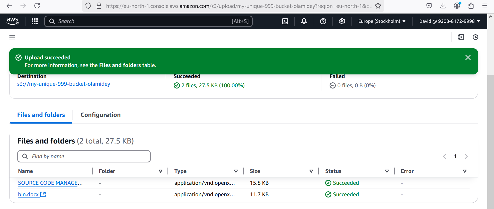
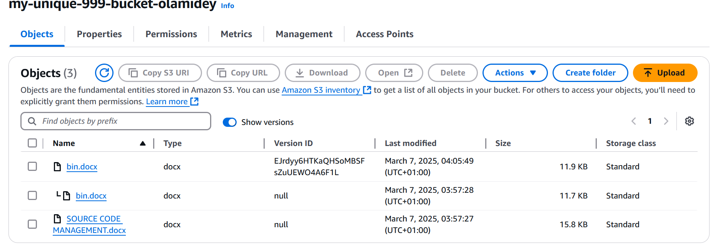
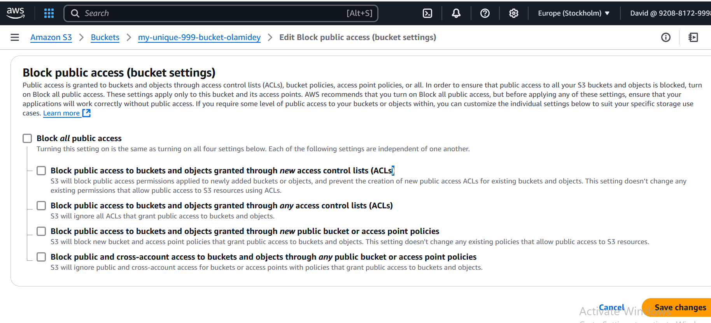
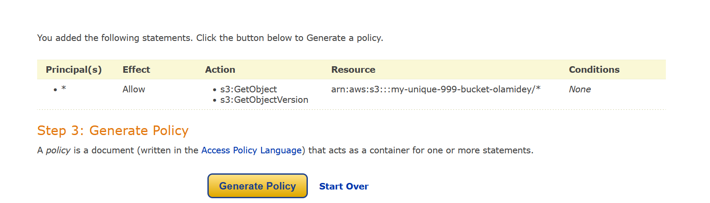
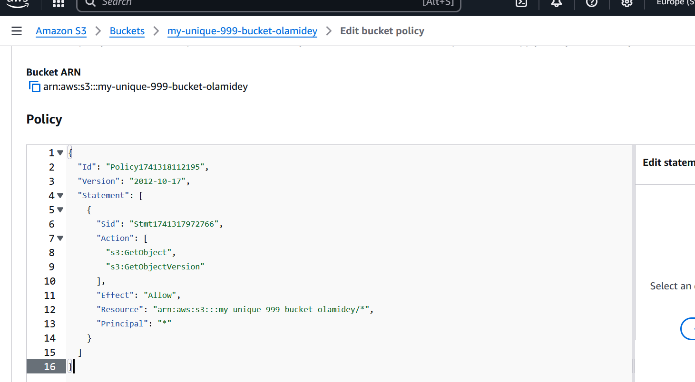
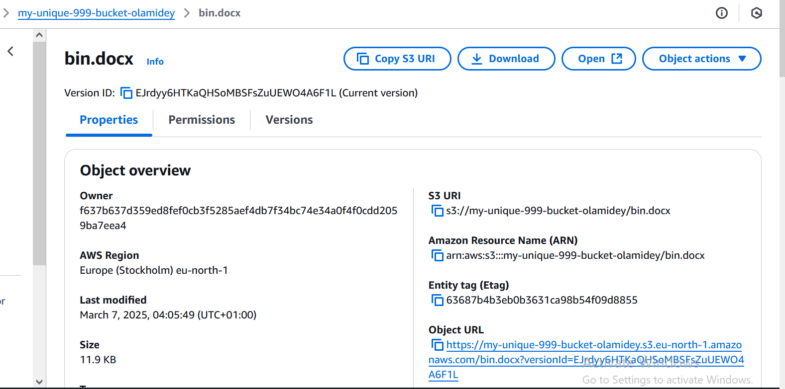

## S3 Mini Project

### Uploading objects into my bucket shown below

### Versioning demonstrated below:

### Viewing the content of both versions
* Unblock all public access

* Creating a bucket policy to specify the actions you want the pulic to be able to performon your file

* Adding the policy

* Version of the new object was confirmed different

### Creating a lifecycle policy
